# 3D Ζάρι

Σχεδιάζουμε ένα ζάρι που μπορούμε να εκτυπώσουμε και να χρησιμοποιήσουμε στα παιχνίδια μας. Το ζάρι μπορεί να έχει στις πλευρές ημισφαιρικές λακουβίτσες, χαραγμένα νούμερα ή άλλα σχέδια της επιλογής μας που μπορεί να αντιστοιχούν στα νούμερα 1-6 που είναι το σύνηθες, μπορεί και όχι, ανάλογα με την χρήση και τη φαντασία του σχεδιαστή. Για τον λόγο αυτό, στο ζάρι του παραδείγματός μας φτιάχνουμε σε κάθε πλευρά διαφορετικό σχέδιο (σχεδιάζονται ενδεικτικά τρεις πλευρές). Προσοχή ένα ζάρι δεν μπορεί να έχει εξογκώματα διότι δεν θα κάθεται καλά στις έδρες του όταν το ρίχνουμε. 

Η σχεδίαση γίνεται με το λογισμικό Tinkercad, ή άλλο παρόμοιο.

Βήματα:

1) Τοποθετούμε στην επιφάνεια εργασίας έναν κύβο και ορίζουμε τις διαστάσεις του έτσι ώστε να είναι ευκρινής (π.χ. 40x40x40mm)
2) Στρογγυλεύουμε τις ακμές του.
3) Τοποθετούμε στην επιφάνεια εργασίας μια σφαίρα και ορίζουμε τις διαστάσεις της αναλογικά με το μέγεθος του ζαριού (π.χ. 4x4x4mm).
4) Μετατρέπουμε τη σφαίρα σε τρύπα και την ευθυγραμμίζουμε στο κέντρο της πλευράς του κύβου.
5) Ομαδοποιούμε τα δύο αντικείμενα και προκύπτει μια ημισφαιρική λακουβίτσα στην πλευρά του κύβου.
6) Με το εργαλείο κειμένου γράφουμε τον αριθμό 2, τον ανυψώνουμε λίγο λιγότερο από το ύψος του κύβου (στο παράδειγμά μας 38mm) και αλλάζουμε τη γραμματοσειρά και άλλα χαρακτηριστικά του εάν επιθυμούμε.
7) Ευθυγραμμίζουμε κατά μήκος και πλάτος
8) Μετατρέπουμε τον αριθμό σε τρύπα και ομαδοποιούμε. Ο αριθμός δύο εμφανίζεται πλέον εγχάρακτος στην κορυφαία έδρα του κύβου.
9) Τοποθετούμε έναν κύκλινδρο στην επιφάνεια εργασίας και ρυθμίζουμε τις διαστάσεις του (π.χ. 30x30x8mm)
10) Περιστρέφουμε τον κύλινδρο και ευθυγραμμίζουμε στο κέντρο της έδρας έτσι ώστε ο κύλινδρος να εισέρχεται περίπου 2mm μέσα στον κύβο.
11) Μετατρέπουμε τον κύλινδρο σε τρύπα και ομαδοποιούμε. Προκύπτει ένα κυλινδρικό βαθούλωμα στην πλαινή έδρα του κύβου.
12) Με το εργαλείο κειμένου γράφουμε τον αριθμό 3 και τον περιστρέφουμε κατάλληλα ώστε να ταιριάζει με τον προσανατολισμό της πλαινής έδρας του κύβου.
13) Ευθυγραμίζουμε στο κέντρο της έδρας βυθίζοντας τον αριθμό μέσα στον κύβο έτσι ώστε να μην προεξέχει.
14) Ομαδοποιούμε.

      
|         Βήμα 1          |        Βήμα 2,3      |
|:----------------------------------:|:------------------------------------:|
| 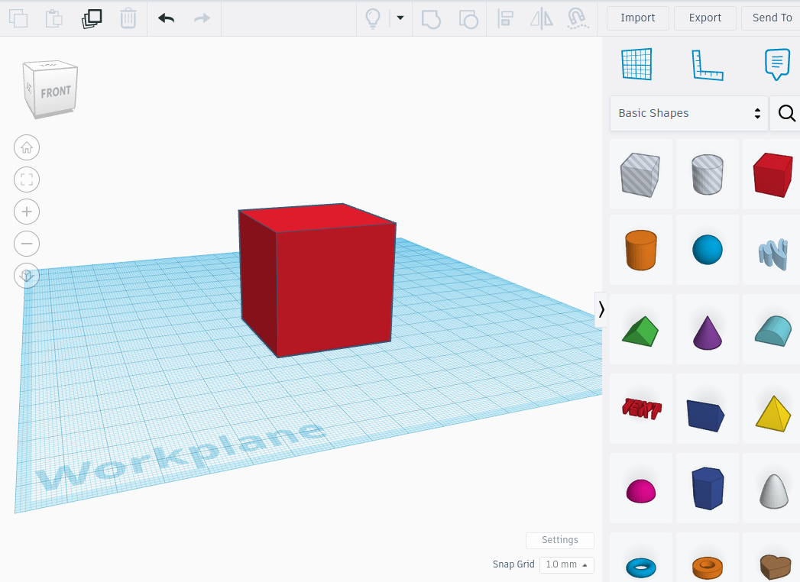 | 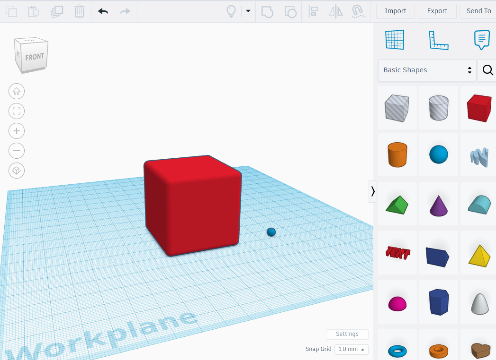 |
|         Βήμα 4          |          Βήμα 5           |
| 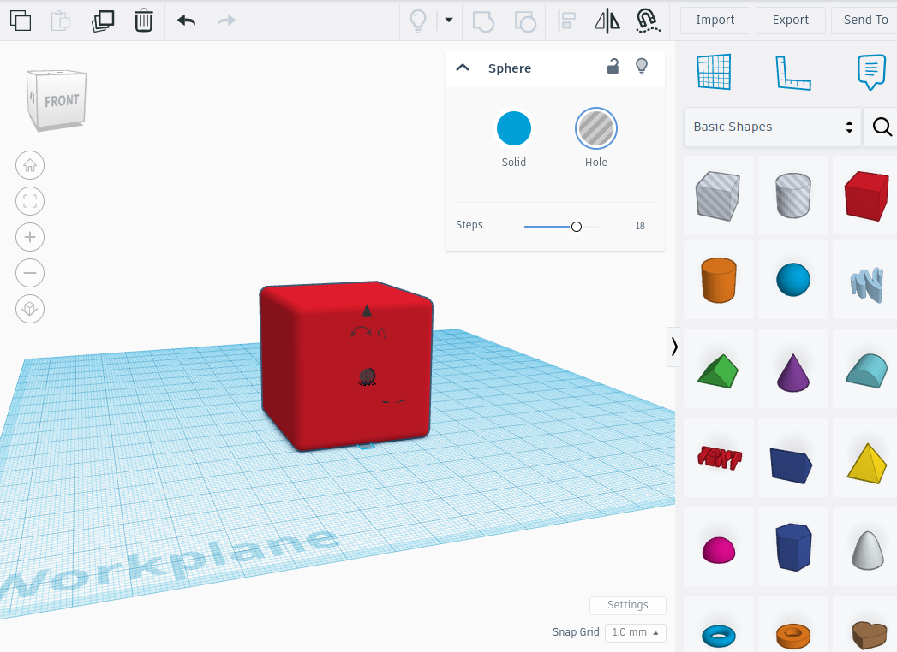 | 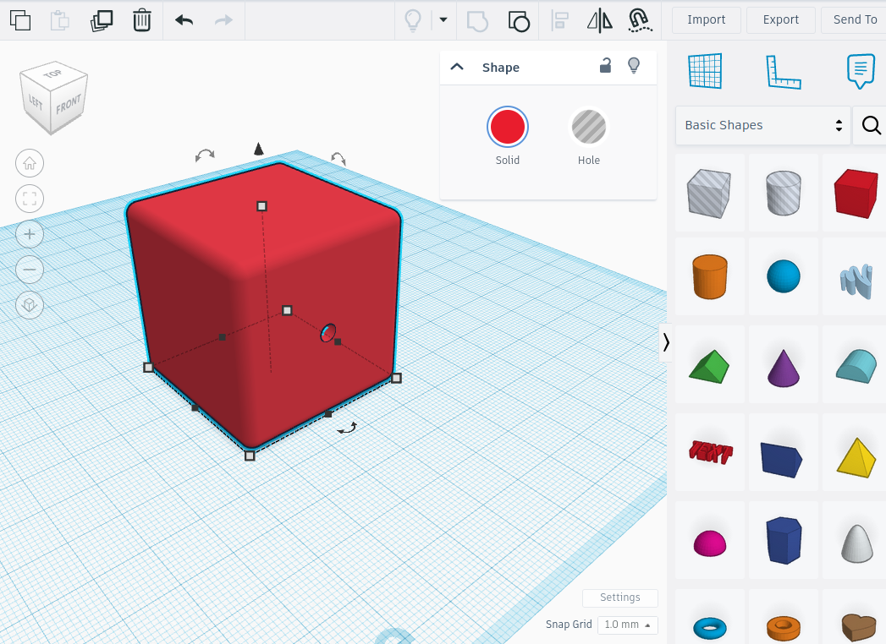 |
|         Βήμα 6           |         Βήμα 7           |
| 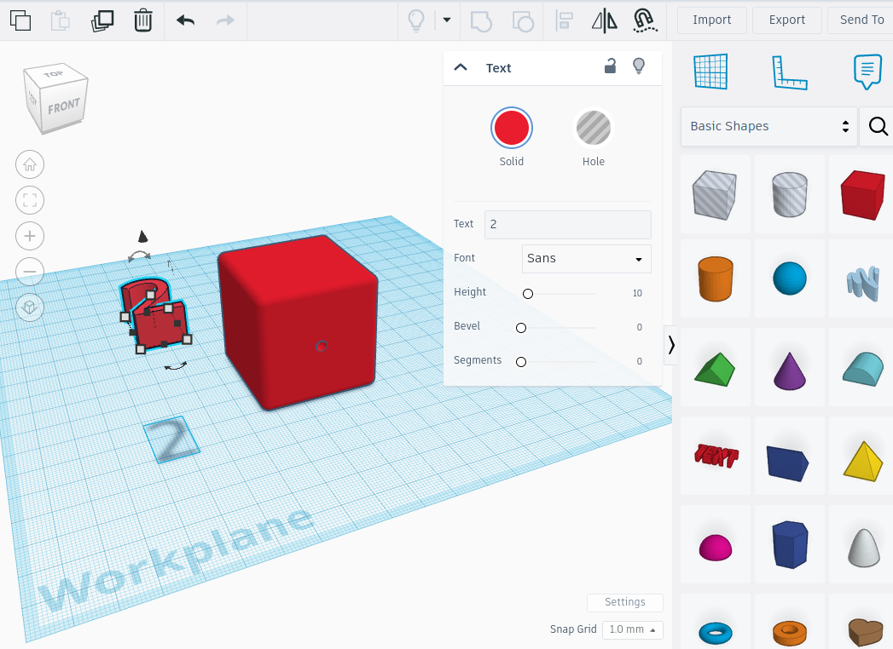 | 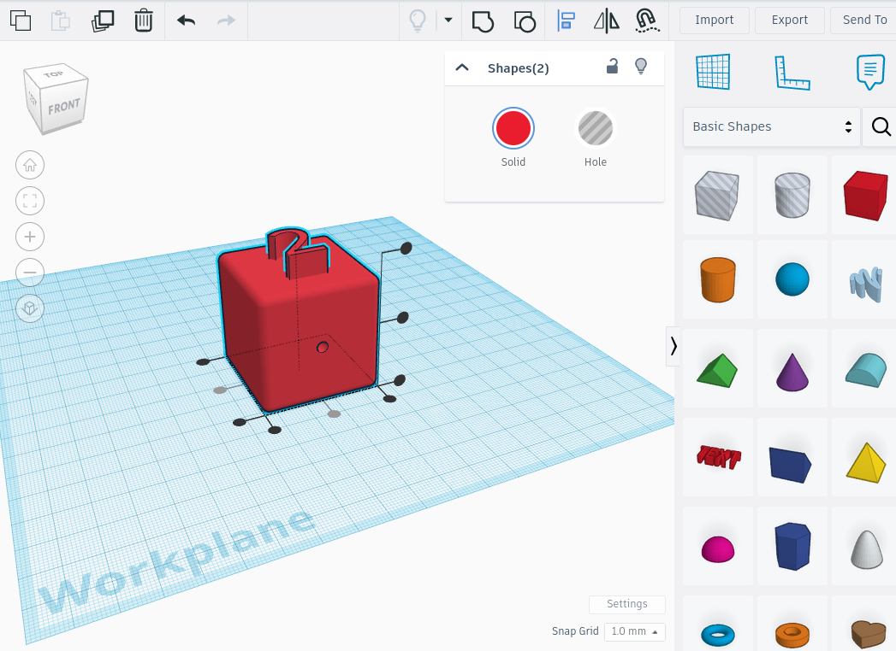 |
|         Βήμα 8          |          Βήμα 9           |
| 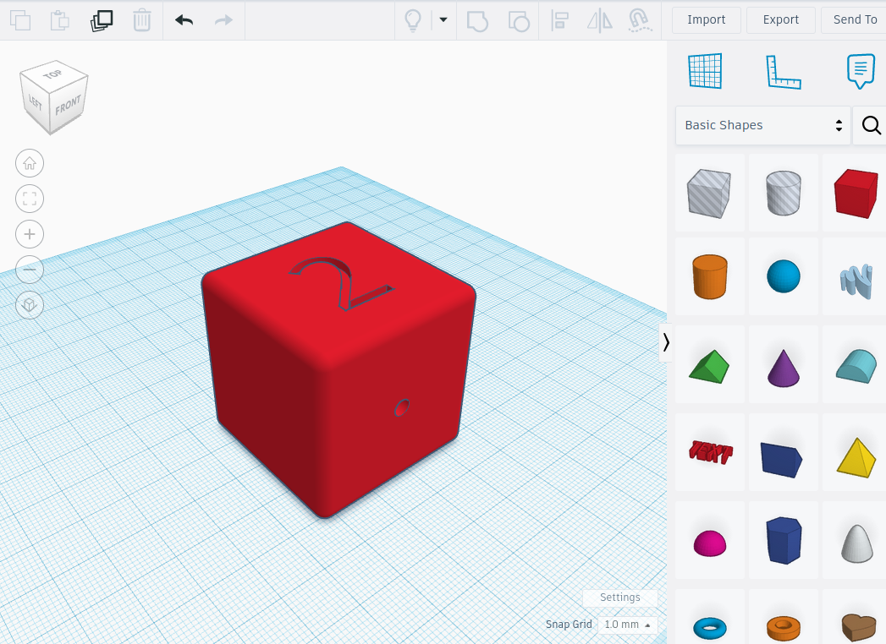 | 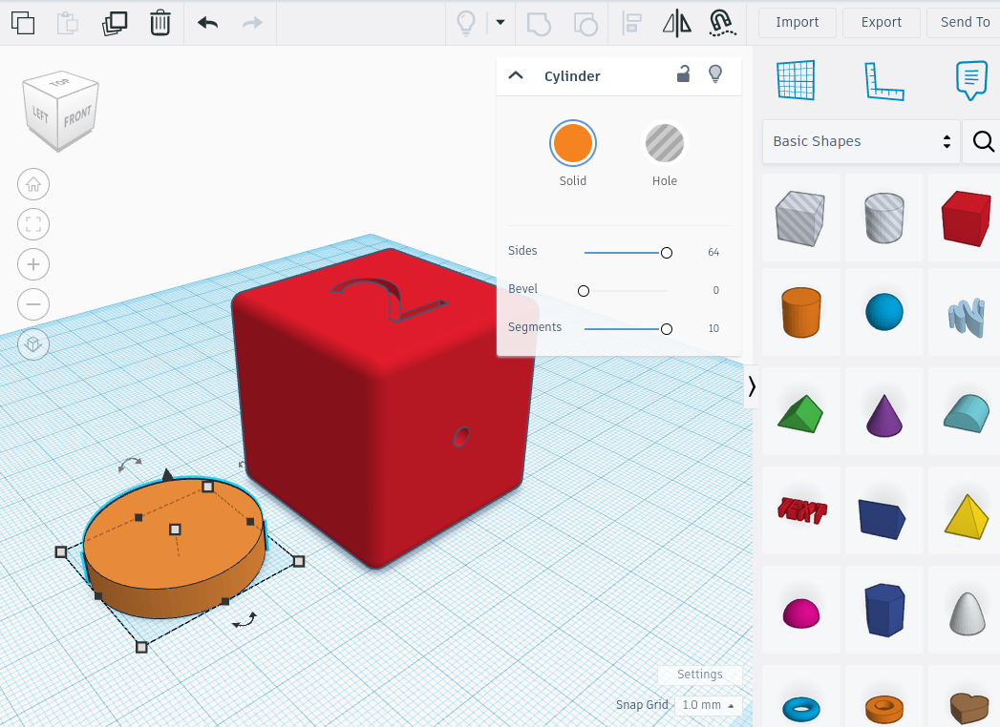 |
|         Βήμα 10         |          Βήμα 11          |
| 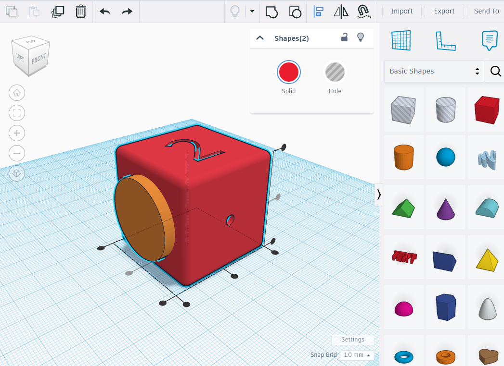 | 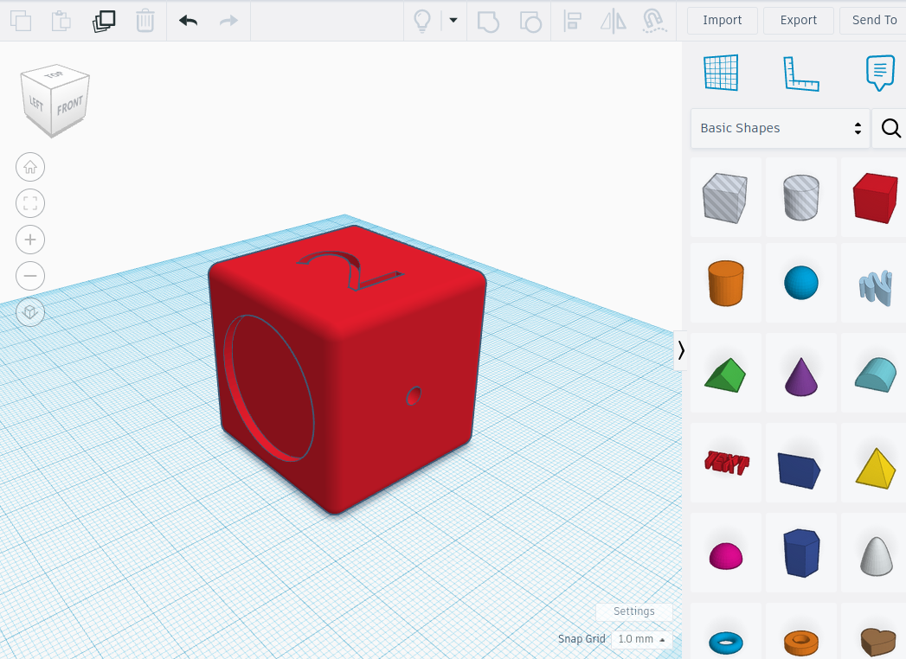 |
|         Βήμα 12         |          Βήμα 13,14       |
| 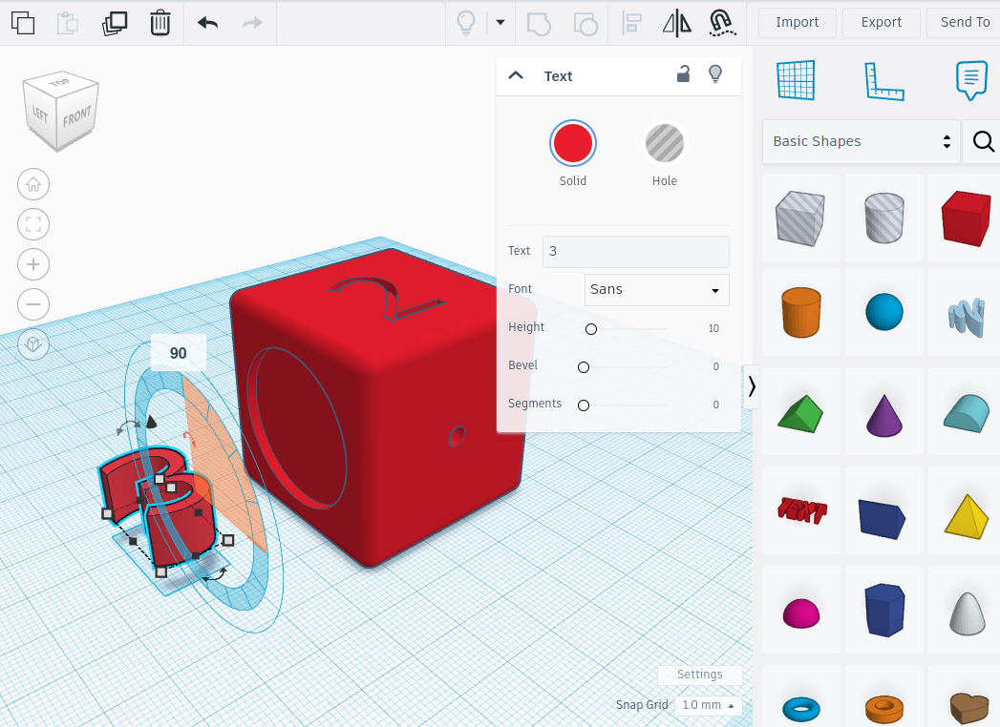 | 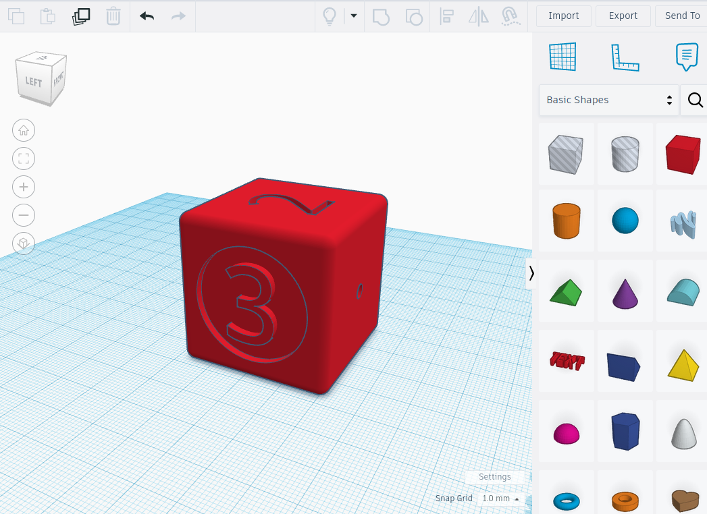 |

Στη συνέχεια μπορούμε να εκτυπώσουμε το ζάρι σε όποια διάσταση θέλουμε (π.χ. 15x15x15mm)

Η διάθεση του έργου αυτού γίνεται με άδεια Creative Commons Αναφορά Δημιουργού - Μη Εμπορική Χρήση - Παρόμοια Διανομή 3.0 Ελλάδα (CC BY-NC-SA 3.0 GR).
